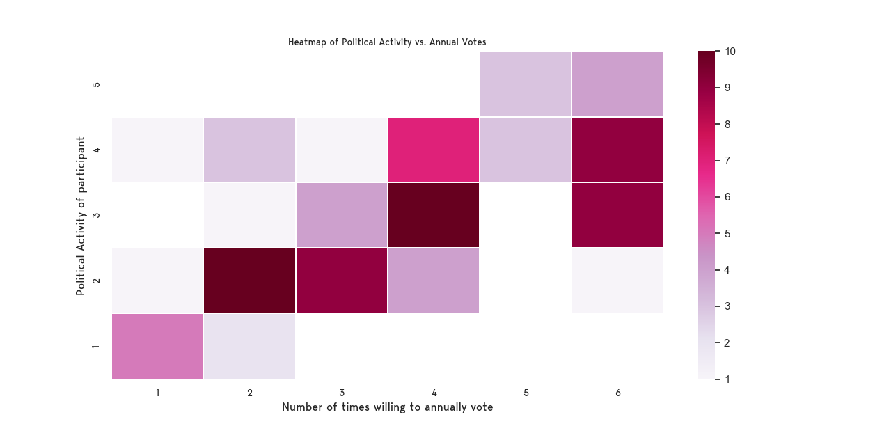
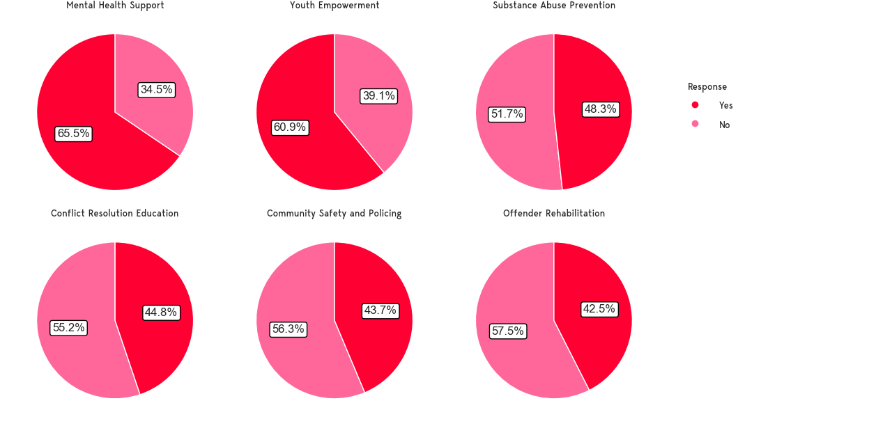
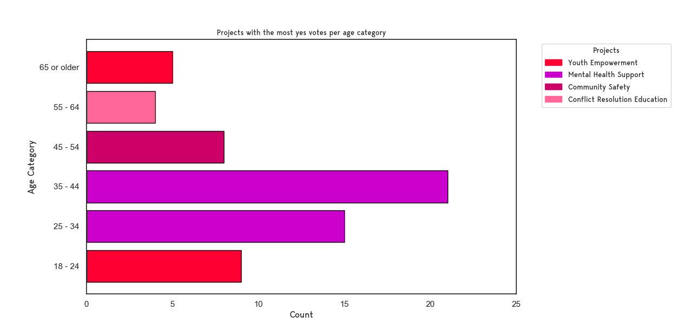
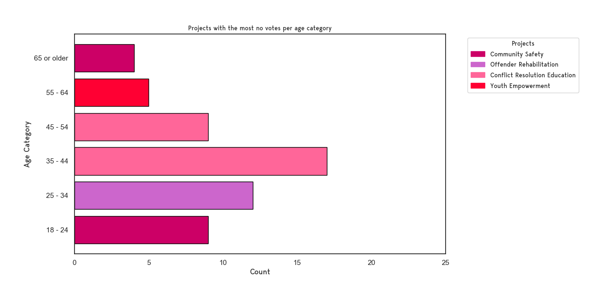
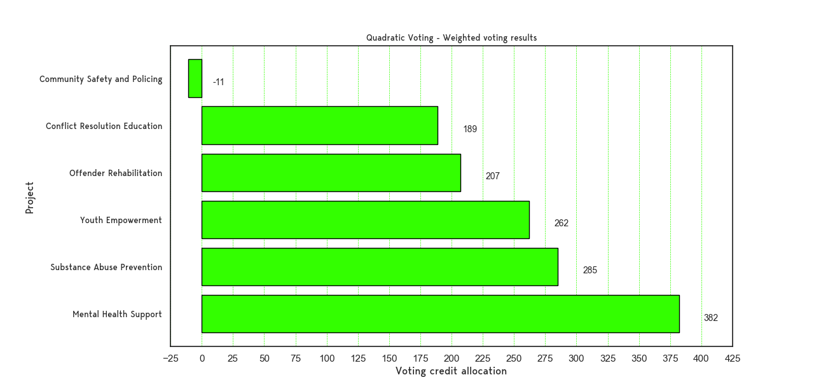

# Results

A total of 87 completed polls were submitted for the Quadratic London alternative governance project. There were 74 email respondents, 13 ENS (Ethereum) respondents, 15 polls were incomplete.

A QR code campaign was ran online and flyers we handed out whilst talking to the public around Islington and Hackney, London.

Although the project had its flaws in terms of messaging and ease of data collection which resulted in lower than expected participation the results are nevertheless interesting and serve as benchmark for improvement, most importantly the polls in comparison indicate quadratic voting has expressed the intensity of the voters preference.

### Age Distribution

<figure><figcaption>
The distribution of ages that participated in the project
</figcaption></figure>

### Gender Distribution&#x20;

<figure><figcaption>
The distribution of gender(s) that participated in the project
</figcaption></figure>

#### Does prior knowledge and/or belief in alternative governance influence higher participation in voting? 

Out of the 87 participants, 21 had prior knowledge of quadratic voting. Those with or without prior QV knowledge who answered 'Yes' to believing in alternative forms of governance are willing to vote on average 4 times or more per year. Those that answered 'No' to alternative forms of governance are unlikely to vote more than 2 times per year.

<table><thead><tr><th width="412">Participant believes in alternative Governance</th><th width="85">No</th><th width="88">Maybe</th><th>Yes</th></tr></thead><tbody><tr><td><em><strong>Prior Quadratic Voting knowledge</strong></em> </td><td></td><td></td><td></td></tr><tr><td><em>Yes</em></td><td>0</td><td>4</td><td>17</td></tr><tr><td><em>No</em></td><td>21</td><td>7</td><td>38</td></tr></tbody></table>

<figure><figcaption></figcaption></figure>

### Correlation between self ascribed political activity and number of times willing to vote per year.

There is a moderate/positive correlation between political activity and willingness to vote annually. This suggests that as political activity increases, the willingness to vote more frequently per year also tends to increase.

<figure><figcaption></figcaption></figure>

Correlation coefficient between political activity and annual votes is 0.6399883782308737.                    -1 being perfect _negative_ correlation and 1 being perfect _positive_ correlation.

### Results from traditional plurality voting, in ranked order. 

<figure><figcaption></figcaption></figure>

We will see how this result compares to the quadratic voting poll shortly. From the traditional vote we can see how projects faired amongst age categories.

_Projects with the most **'Yes'** votes._

<figure><figcaption></figcaption></figure>

* Mental health support and counselling services expansion received the highest 'Yes' count for the age categories 25-34 and 35-44.&#x20;
* Youth Empowerment and Mentorship Program received the highest 'Yes' count for the age categories 18-24 and 65 or older.
* Community Safety and Policing Reform Initiative received the highest 'Yes' count for age category 45-54 and Education and Outreach Campaign on Conflict Resolution received the highest 'Yes' count for age category 55-64.

_Projects with the most **'No'** votes_.

<figure><figcaption></figcaption></figure>

* Education and Outreach Campaign on Conflict Resolution received the highest 'No' count in the age categories 35-44 and 45-54.
* Community Safety and Policing Reform Initiative received the highest 'No' count in the age categories 18-24 and 65 or older.
* Rehabilitation and Reintegration Program for Former Offenders received the highest 'No' count in the age category 25-34.
* Youth Empowerment and Mentorship Program received the highest 'No' count in the age category 55-64.

## Quadratic voting results

<figure><figcaption></figcaption></figure>

### Comparative analysis

**Mental Health Support:**

* _Quadratic Voting_: Ranked 1st with 382 votes.
* _Traditional Voting:_ Ranked 1st.

Both voting methods agree on the importance of mental health support, indicating a strong consensus on its priority.

**Substance Abuse Prevention:**

* Quadratic Voting: Ranked 2nd with 285 votes.
* Traditional Voting: Ranked 3rd.

Quadratic voting places higher importance on substance abuse prevention compared to traditional voting, suggesting that those who care about it, care deeply.

**Youth Empowerment:**

* Quadratic Voting: Ranked 3rd with 262 votes.
* Traditional Voting: Ranked 2nd.

Youth empowerment is highly prioritized in both methods but slightly more in traditional voting. This suggests broad support but possibly less intensity compared to mental health and substance abuse issues.

