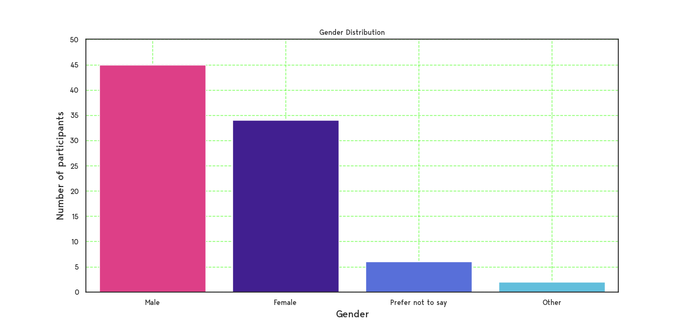
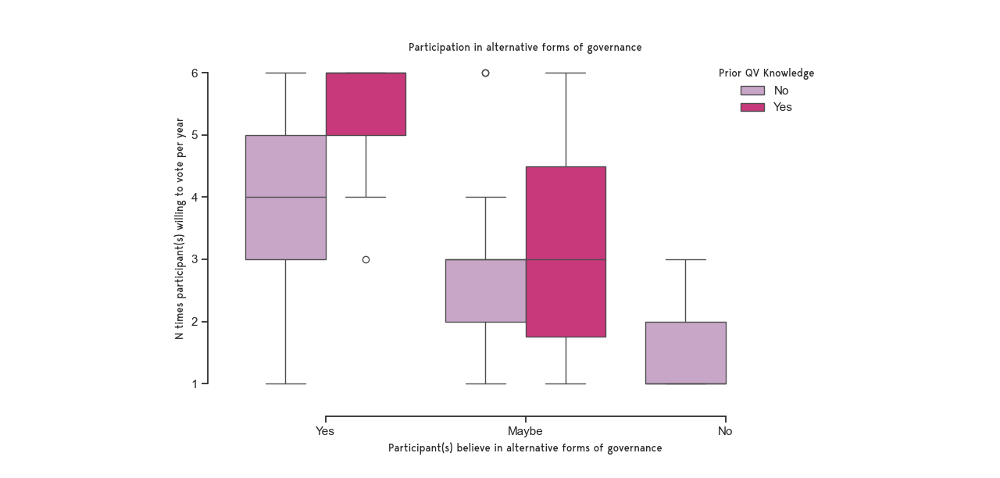

# Results

A total of 87 completed polls were submitted for the Quadratic London alternative governance project.  There were 15 incomplete polls, general feedback being difficulty of navigation and too many steps. There were 74 email respondents, 13 ENS (Ethereum) respondents.

A QR code campaign was ran online and flyers we handed out whilst talking to the public around Islington and Hackney, London.

Although the project had its flaws in terms of messaging and ease of data collection which resulted in lower than expected participation the results are nevertheless interesting and serve as benchmark for improvement, most importantly the polls in comparison indicate quadratic voting does express the intensity of the voters preference.

### Age Distribution

<figure><figcaption>
The distribution of ages that participated in the project
</figcaption></figure>

#### Gender Distribution

<figure><figcaption>
The distribution of gender that participated in the project
</figcaption></figure>

#### Does prior knowledge and/or belief in alternative governance influence higher participation in voting? 

they were 99 eho previosu knew qv etc..

<figure><figcaption>
Participants with prior knowledge of quadratic voting and the amount they would vote per year should they or should not believe in alternative forms of governance
</figcaption></figure>
