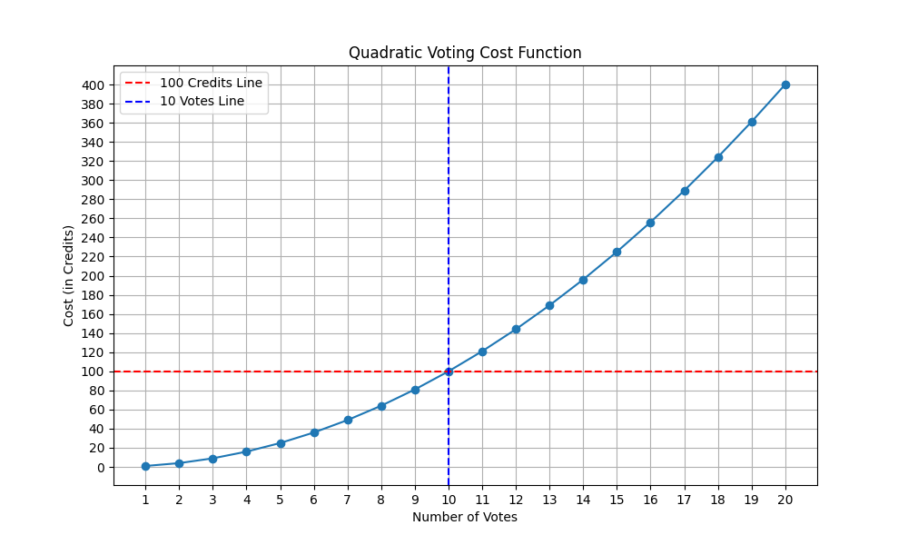

# How Quadratic voting works

Quadratic voting allows individuals to cast votes on issues based on the strength of their preference. The cost of each additional vote grows quadratically, meaning if 1 vote costs 1 credit, 2 votes cost 4 credits (2²), 3 votes cos t 9 credits (3²), and so on. this system ensures that only those with strong preferences will use more credits, balancing majority rule with minority interests. Imagine you have 100 credits to delegate over an array of issues. Below you can see the cost of your expression. You can vote negative if you wish.

<table><thead><tr><th width="212" align="center">Number of votes</th><th width="247" align="center">Quadratic Vote Credits</th></tr></thead><tbody><tr><td align="center">1</td><td align="center">1</td></tr><tr><td align="center">2</td><td align="center">4</td></tr><tr><td align="center">3</td><td align="center">9</td></tr><tr><td align="center">4</td><td align="center">16</td></tr><tr><td align="center">5</td><td align="center">25</td></tr><tr><td align="center">6</td><td align="center">36</td></tr><tr><td align="center">7</td><td align="center">49</td></tr><tr><td align="center">8</td><td align="center">64</td></tr><tr><td align="center">9</td><td align="center">81</td></tr><tr><td align="center">10</td><td align="center">100</td></tr></tbody></table>

This mechanism discourages any single individual from dominating the voting process unless they have a very strong preference and are willing to incur the higher costs for additional votes. This is where minority strength can balance the scale or even outweigh a majority.

Alternative mechanisms like quadratic voting can serve as a litmus test; for example, subsidized school care for single parents. Imagine a scenario where single parents' expression of voting strength may outweigh the indifference of a married couple with a modest income who would prefer to spread their credits elsewhere. You can start to gauge how using this mechanism can work as an indicator of the prescient needs that reflect society much faster than our current methods.

It is worth noting that a minority group could be one that wishes to have the right to [firearms](https://news.gallup.com/poll/1645/guns.aspx). Let's imagine a political party wants to build its manifesto pre-election and holds a series of polls. Some members delegate many credits for the inclusion, while other members are against it and wish to vote this issue down using their credits to vote negatively. You can see the dynamic nature of expression at play here.

Here is the quadratic cost of using your votes. This example shows the expenditure of your credits if you were to vote with strength in one direction on one cause.

<figure><figcaption>
 As you can see, allocating more votes to a single project quickly becomes very expensive.
</figcaption></figure>

In 2019 The Democratic Caucus of the Colorado State House of Representatives experimented with Quadratic Voting, click [here](https://www.wired.com/story/colorado-quadratic-voting-experiment/) for insight. The [RadicalxChange](https://www.radicalxchange.org/wiki/colorado-qv/#senate-and-house-democrats-2023-qv-polls) Foundation worked with the Democratic Caucus to decide how distribute a ''limited pot of money''. Here are the results from that poll.

<figure><figcaption>
<a href="https://www.radicalxchange.org/wiki/colorado-qv/#senate-and-house-democrats-2023-qv-polls">https://www.radicalxchange.org/wiki/colorado-qv/#senate-and-house-democrats-2023-qv-polls</a>
</figcaption></figure>
